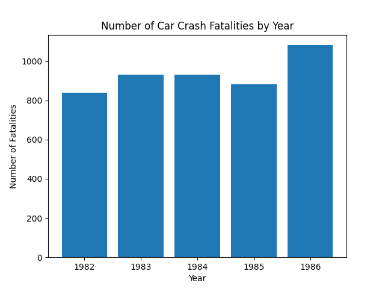

# **Individual Project 1: Pandas Descriptive Statistics**
##### The goal of this project is to utilize pandas to create summary statistics and visualizations for a data set
#### Requirements:

- [x] Jupyter Notebook with: 
    - Cells that perform descriptive statistics using Polars or Panda.
    - Tested by using nbval plugin for pytest
- [x] Makefile with the following:
    - Run all tests (must test notebook and script and lib)
    - Formats code with Python black Links to an external site.
    - Lints code with Ruff Links to an external site.
    - Installs code via:  pip install -r requirements.txt
- [x] test_script.py to test script
- [x] test_lib.py to test library
- [x] Pinned requirements.txt
- [x] Gitlab Actions performs all four Makefile commands with badges for each one in the README.md

---
### Project Video 
------------
##### Please click the link below to check out a demo video/project walkthrough!
https://youtu.be/B-4DL442OH4 

---
### Workflow Summary and Explanation
##### This project contains the following dependencies:
- pylint 
- black
- pytest
- pandas
- matplotlib
- jupyter
- ruff 
- nbval 
- tabulate 

---
### Folder Navigation
---
- Project Folder
    - .devcontainer
        - devcontainer.json
        - Dockerfile
    - .github
        - workflows
            - format.yml
            - install.yml
            - lint.yml
            - test.yml
    - data
        - us_driving_fatalities.csv
    - python files
        - tests
            - test_desc_stats_main.py
            - test_lib.py
        - desc_stats_main.py
        - lib.py
    - driving summary.md (generated)
    - Makefile
    - README.md
    - requirements.txt
---
### Descriptive Statistics Table
---
###### The following table is the desc_stats.py/jupyter output, indicating the count, mean, std, min, quartiles, and max for the numeric variables

|       |       year |    fatal |
|:------|-----------:|---------:|
| count |  336       |  336     |
| mean  | 1985       |  928.664 |
| std   |    2.00298 |  934.051 |
| min   | 1982       |   79     |
| 25%   | 1983       |  293.75  |
| 50%   | 1985       |  701     |
| 75%   | 1987       | 1063.5   |
| max   | 1988       | 5504     |

---
### Visualizations
---
###### The following graph is a visualization created by the script, which displays a comparison of the number of driving fatalities per year reported in the dataset

