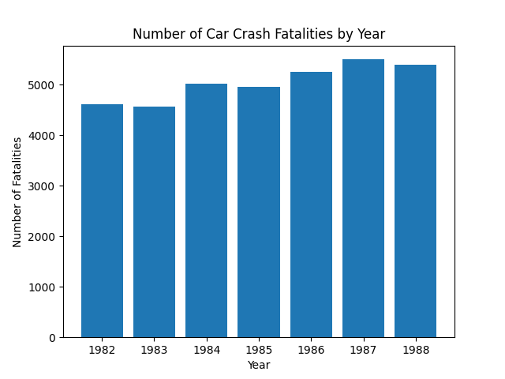

Describe:
|       |   Unnamed: 0 |       year |    spirits |     unemp |   income |    emppop |     beertax |    baptist |     mormon |   drinkage |         dry |   youngdrivers |    miles |    fatal |   nfatal |   sfatal |   fatal1517 |   nfatal1517 |   fatal1820 |   nfatal1820 |   fatal2124 |   nfatal2124 |    afatal |              pop |        pop1517 |        pop1820 |        pop2124 |   milestot |   unempus |   emppopus |          gsp |
|:------|-------------:|-----------:|-----------:|----------:|---------:|----------:|------------:|-----------:|-----------:|-----------:|------------:|---------------:|---------:|---------:|---------:|---------:|------------:|-------------:|------------:|-------------:|------------:|-------------:|----------:|-----------------:|---------------:|---------------:|---------------:|-----------:|----------:|-----------:|-------------:|
| count |     336      |  336       | 336        | 336       |   336    | 336       | 336         | 336        | 336        | 336        | 336         |    336         |   336    |  336     |  336     |  336     |    336      |     336      |     336     |     336      |     336     |     336      |  336      |    336           |    336         |    336         |    336         |      336   | 336       |  336       | 336          |
| mean  |     168.5    | 1985       |   1.75369  |   7.34673 | 13880.2  |  60.8057  |   0.513256  |   7.15692  |   2.80193  |  20.4556   |   4.26707   |      0.18593   |  7890.75 |  928.664 |  182.583 |  109.949 |     62.6101 |      12.2619 |     106.661 |      33.5268 |     126.872 |      41.378  |  293.333  |      4.93027e+06 | 230815         | 249090         | 336390         |    37101.5 |   7.52857 |   59.9714  |   0.0253135  |
| std   |      97.1391 |    2.00298 |   0.683575 |   2.5334  |  2253.05 |   4.72166 |   0.477844  |   9.76262  |   9.66528  |   0.899025 |   9.5009    |      0.0248736 |  1475.66 |  934.051 |  188.431 |  108.54  |     55.7291 |      12.2534 |     104.224 |      33.2383 |     131.789 |      42.9303 |  303.581  |      5.0737e+06  | 229896         | 249346         | 345304         |    37454.4 |   1.47938 |    1.58505 |   0.0431732  |
| min   |       1      | 1982       |   0.79     |   2.4     |  9513.76 |  42.9932  |   0.0433109 |   0        |   0.1      |  18        |   0         |      0.073137  |  4576.35 |   79     |   13     |    8     |      3      |       0      |       7     |       0      |      12     |       1      |   24.6    | 479000           |  21000         |  21000         |  30000.2       |     3993   |   5.5     |   57.8     |  -0.123641   |
| 25%   |      84.75   | 1983       |   1.3      |   5.475   | 12085.8  |  57.6914  |   0.208849  |   0.626752 |   0.27216  |  20        |   0         |      0.170373  |  7182.54 |  293.75  |   53.75  |   35     |     25.75   |       4      |      38     |      11      |      42     |      13      |   90.4977 |      1.54525e+06 |  71749.9       |  76962.1       | 103500         |    11691.5 |   6.2     |   57.9     |   0.00118233 |
| 50%   |     168.5    | 1985       |   1.67     |   7       | 13763.1  |  61.3647  |   0.352589  |   1.74925  |   0.393111 |  21        |   0.0868125 |      0.185387  |  7796.22 |  701     |  135     |   81     |     49      |      10      |      82     |      24      |      97.5   |      30      |  211.594  |      3.3105e+06  | 163000         | 170982         | 241000         |    28483.5 |   7.2     |   60.1     |   0.0324127  |
| 75%   |     252.25   | 1987       |   2.0125   |   8.9     | 15175.1  |  64.4125  |   0.651573  |  13.1271   |   0.62932  |  21        |   2.42481   |      0.202185  |  8504.02 | 1063.5   |  212     |  131     |     77      |      15.25   |     130.25  |      44      |     150.5   |      49      |  363.958  |      5.75173e+06 | 270500         | 308311         | 413000         |    44139.8 |   9.6     |   61.5     |   0.0565011  |
| max   |     336      | 1988       |   4.9      |  18       | 22193.5  |  71.2687  |   2.72076   |  30.3557   |  65.9165   |  21        |  45.7921    |      0.281625  | 26148.3  | 5504     | 1049     |  603     |    318      |      76      |     601     |     196      |     770     |     249      | 2094.9    |      2.8314e+07  |      1.172e+06 |      1.321e+06 |      1.893e+06 |   241575   |   9.7     |   62.3     |   0.142361   |

